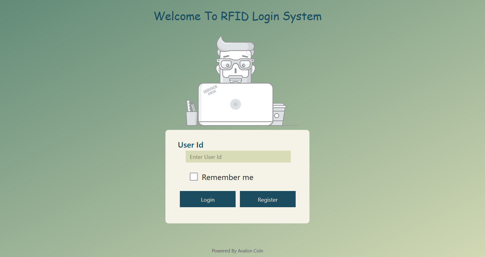

# NFC Login Tool using PRINT Cipher

Near Field Communication (NFC) technology is a short range communication protocol that allows two nearby devices to exchange information with each other.

NFC provides a secure form of authentication that is being used in smart cards and mobile authentication.

Here, In order to prevent the data from being hacked, NFC compatible login tool is defined which is encrypted using PRINT Cipher.

The password received by the receiver will be encrypted using PRINT Cipher.
 
 

The Login page is shown below :-
 
 

